# 动态规划解题框架以及相关例题

## 引言

动态规划是算法与数据结构的重难点之一，其包含了「分治思想」、「空间换时间」、「最优解」等多种基石算法思想，常作为笔面试中的中等困难题出现。为帮助读者全面理解动态规划，知晓其来龙去脉，本文将从以下几个角度切入介绍：

1. 动态规划问题特点，动态规划和分治算法的联系与区别；
2. 借助例题介绍重叠子问题和最优子结构分别是什么，以及动态规划是如何解决它们的；
3. 动态规划的解题框架总结；
4. 动态规划的练习例题，从易到难排序；

## 动态规划特点

「分治」是算法中的一种基本思想，其通过将原问题分解为**子问题**，不断递归地将子问题分解为更小的子问题，并**通过组合子问题的解**来得到原问题的解。

类似于分治算法，「动态规划」也通过组合子问题的解得到原问题的解。不同的是，适合用动态规划解决的问题具有「重叠子问题」和「最优子结构」两大特性。

### 重叠子问题

动态规划的子问题是有重叠的，即各个子问题中包含重复的更小子问题。若使用暴力法穷举，求解这些相同子问题会产生大量的重复计算，效率低下。

动态规划**在第一次求解某子问题时，会将子问题的解保存**；后续遇到重叠子问题时，则**直接通过查表获取解**，保证每个独立子问题只被计算一次，从而降低算法的时间复杂度。从本质上来看，就是空间换取速度，通过减少重复运算来减少运算时间。

### 最优子结构

如果一个问题的最优解可以由其**子问题的最优解组合构成**，并且这些子问题可以独立求解，那么称此问题具有最优子结构。

动态规划从基础问题的解开始，**不断迭代组合、选择子问题的最优解，最终得到原问题最优解**。

## 重叠子问题示例：斐波那契数列

> 斐波拉契数形成的数列为$[0,1,1,2,3,5,8,13,\cdots]$,数学定义如下：
>
> $$
> F_0=0
> $$
>
> $$
> F_1=1
> $$
>
> $$
> F_n=F_{n-1}+F_{n-2}
> $$
>
> 题目： 求取第 $n$ 个斐波那契数（从第 0 个斐波那契数开始）。

以下，本文从「暴力递归」 $\rightarrow$ 「记忆化递归」 $\rightarrow$ 「动态规划」三种解法，介绍重叠子问题的概念与解决方案。

### 方法一：暴力递归

设斐波那契数列第 $n$ 个数字为 $f(n)$ 。根据数列定义，可得 $f(n) = f(n - 1) + f(n - 2)$ ，且第 0 , 1 个斐波那契数分别为 $f(0) = 0$, $f(1) = 1$。

我们很容易联想到使用分治思想来求取 $f(n)$ ，即将求原问题 $f(n)$分解为求子问题 $f(n-1)$ 和 $f(n-2)$，向下递归直至已知的 $f(0)$ 和 $f(1)$ ，最终组合这些子问题求取原问题 $f(n)$ 。

```python
# 求第 n 个斐波那契数
def fibonacci(n):
    if n == 0: return 0 # 返回 f(0)
    if n == 1: return 1 # 返回 f(1)
    return fibonacci(n - 1) + fibonacci(n - 2) # 分解为两个子问题求解
```

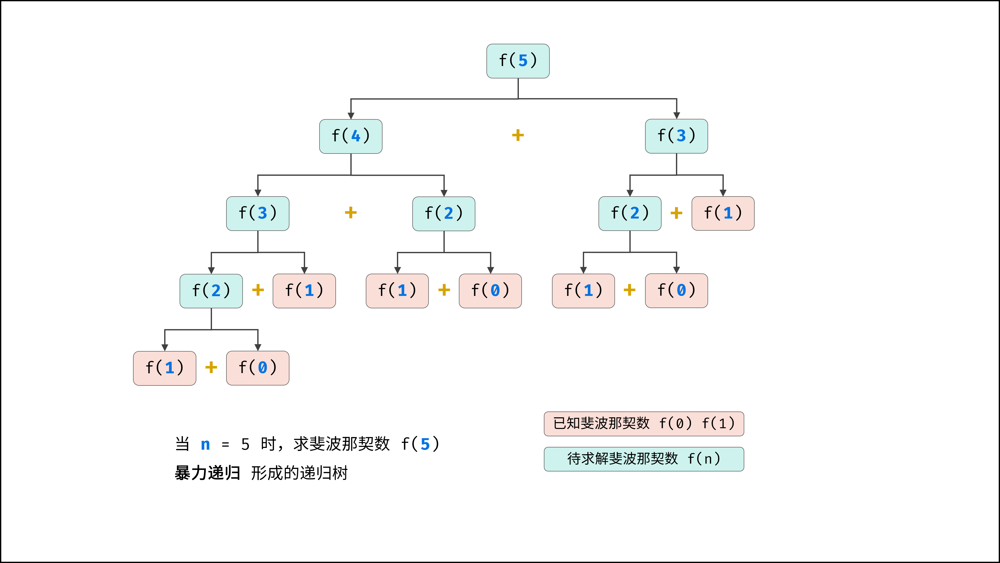
如上图所示，为暴力递归求斐波那契数 $f(5)$ 形成的二叉树，树中的每个节点代表着执行了一次 `fibonacci() `函数，且有：

* 执行一次 `fibonacci()` 函数的时间复杂度为 $O(1)$ ；
* 二叉树节点数为指数级 $O(2^n)$ ；

因此，暴力递归的总体时间复杂度为 $O(2^n)$。此方法效率低下，随着 $n$ 的增长产生指数级爆炸。

### 方法二：记忆化递归

观察发现，暴力递归中的子问题多数都是**重叠子问题**(重复计算)，即：

$$
f(n)=f(n−1)+f(n−2)  包含f(n−2)
$$

$$
f(n−1)=f(n−2)+f(n−3)重复f(n−2)
$$

$$
f(n−2)=f(n−3)+f(n−4)重复f(n−3)
$$

$$
...  以此类推
$$

这些重叠子问题产生了大量的递归树节点，其**不应被重复计算**。实际上，可以在递归中**第一次求解子问题时，就将它们保存**；后续递归中再次遇到相同子问题时，直接访问内存赋值即可。记忆化递归的代码如下所示。

```python
def fibonacci(n, dp):
    if n == 0: return 0           # 返回 f(0)
    if n == 1: return 1           # 返回 f(1)
    if dp[n] != 0: return dp[n]   # 若 f(n) 以前已经计算过，则直接返回记录的解
    dp[n] = fibonacci(n - 1, dp) + fibonacci(n - 2, dp) # 将 f(n) 则记录至 dp
    return dp[n]

# 求第 n 个斐波那契数
def fibonacci_memorized(n):
    dp = [0] * (n + 1) # 用于保存 f(0) 至 f(n) 问题的解
    return fibonacci(n, dp)
```

如下图所示，应用记忆化递归方法后，递归树中绝大部分节点被剪枝。此时，`fibonacci()` 函数的调用次数从 $O(2^n)$ 指数级别降低至 $O(n)$ 线性级别，时间复杂度大大降低。
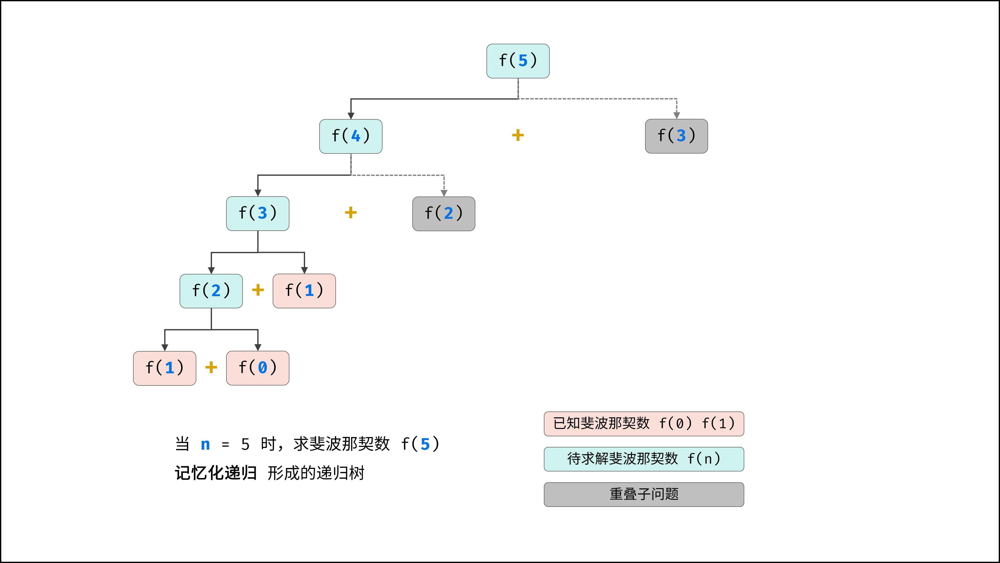

### 方法三：动态规划

递归本质上是基于分治思想的从顶至底的解法。借助记忆化递归思想，可应用动态规划从底至顶求取 $f(n)$ ，代码如下所示。

```python
# 求第 n 个斐波那契数
def fibonacci(n):
    if n == 0: return 0       # 若求 f(0) 则直接返回 0
    dp = [0] * (n + 1)        # 初始化 dp 列表
    dp[0], dp[1] = 0, 1       # 初始化 f(0), f(1)
    for i in range(2, n + 1): # 状态转移求取 f(2), f(3), ..., f(n) 
        dp[i] = dp[i - 1] + dp[i - 2]
    return dp[n]              # 返回 f(n)
```

其实中心思想跟存储法一致，只不过是不需要调用递归，直接将运算完的结果直接写进列表中
如下图所示，为动态规划求解 $f(5)$ 的迭代流程，其是转移方程 $f(n) = f(n - 1) + f(n - 2)$的体现。
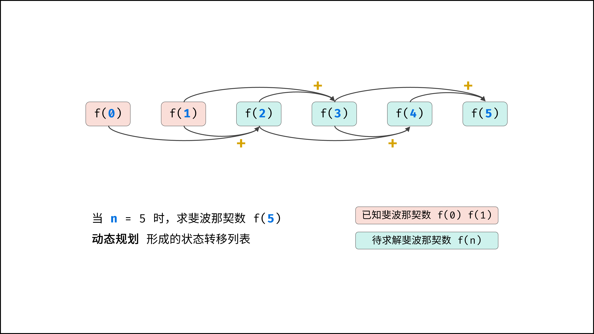

#### 优化算法：

上述动态规划解法借助了一个 `dp` 数组保存子问题的解，其空间复杂度为 $O(N)$ 。而由于 $f(n)$ 只与 $f(n - 1)$f 和 $f(n - 2)$ 有关，因此我们可以仅使用两个变量 $a$ , $b$ 交替前进计算即可。此时动态规划的空间复杂度降低至 $O(1)$ ，代码如下所示。

```python
# 求第 n 个斐波那契数
def fibonacci(n):
    if n == 0: return 0       # 若求 f(0) 则直接返回 0
    a, b = 0, 1               # 初始化 f(0), f(1)
    for i in range(2, n + 1): # 状态转移求取 f(2), f(3), ..., f(n) 
        a, b = b, a + b
    return b                  # 返回 f(n)
```

### 示例总结

记忆化递归和动态规划的本质思想是一致的，是对斐波那契数列定义的不同表现形式：

* **记忆化递归 — 从顶至低**： 求 $f(n)$ 需要 $f(n - 1)$ 和 $f(n - 2)$ ； $\cdots$ ；求 $f(2)$ 需要 $f(1)$ 和 $f(0)$ ；而 $f(1)$ 和 $f(0)$ 已知；
* **动态规划 — 从底至顶**： 将已知 $f(0)$ 和 $f(1)$ 组合得到 $f(2)$ ；$\cdots$ ；将 $f(n - 2)$ 和 $f(n - 1)$ 组合得到 $f(n)$ ；

斐波那契数列问题不包含「最优子结构」，只需计算每个子问题的解，避免重复计算即可，并不需要从子问题组合中**选择最优组合**。接下来，本文借助「最高蛋糕售价方案」，介绍动态规划的**最优子结构**概念。

## 最优子结构示例：蛋糕最高售价

> 小力开了一家蛋糕店，并针对不同重量的蛋糕设定了不同售价，分别为:
>
> | 蛋糕重量       | 0           | 1           | 2           | 3           | 4           | 5          | 6            |
> | :--------------: | :--------------: | :--------------: | :--------------: | :--------------: | :--------------: | :--------------: | :--------------: |
> | **售价** | **0** | **2** | **3** | **6** | **7** | **11** | **15** |
> 
>问题： 现给定一个重量为 nn 的蛋糕，问小力应该如何切分蛋糕，达到最高的蛋糕总售价。
设重量为 $n$ 蛋糕的售价为 $p(n)$ ，切分的最高总售价为 $f(n)$ 。

* 子问题： $f(n)$ 的子问题包括 $f(0), f(1), f(2), \cdots, f(n - 1)$，分别代表重量为 $0, 1, 2, \cdots, n - 1$蛋糕的最高售价。 已知无蛋糕时 $f(0) = 0$ ，蛋糕重量为 $1$ 时不可切分 $f(1) = p(1)$ ；
* 最优子结构：

- - 定义： 如果一个问题最优解可以由其子问题最优解组合构成，那么称此问题具有最优子结构。
- - 对于本题： 重量为 $n$ 的蛋糕的总售价可切分为 $n$ 种组合，即重量为 $0, 1, 2, ..., n - 1$ 蛋糕最高售价加上 $n, n - 1, n - 2, \cdots, 1$ 剩余重量蛋糕的售价；从这些组合中，售价最高的组合便是原问题的解 $f(n)$ ，这便是本题的最优子结构。

* 状态转移方程： 找出最优子结构后，易构建出如下的状态转移方程。
* $$f(n)=\max_{0 \leq i < n} (f(i)+p(n−i))$$

这里的 $max$ 是从每一个 $i$ 中进行，因为通常这种题目的定价都是毫无规律的，所以需要遍历每一个符合条件的 $i$ 进行 $max$ 判断

### 方法一：暴力递归

暴力递归解法的代码如下，其时间复杂度为指数级 $O(2^n)$。

```python
# 输入蛋糕价格列表 price_list ，求重量为 n 蛋糕的最高售价
def max_cake_price(n, price_list):
    if n <= 1: return price_list[n] # 蛋糕重量 <= 1 时直接返回
    f_n = 0
    for i in range(n):  # 从 n 种组合种选择最高售价的组合作为 f(n)
        f_n = max(f_n, max_cake_price(i, price_list) + price_list[n - i])
    return f_n          # 返回 f(n)

max_cake_price(4, [0, 2, 3, 6, 7, 11, 15])
```

如下图所示，为暴力递归求解 $f(4)$ 形成的多叉树。
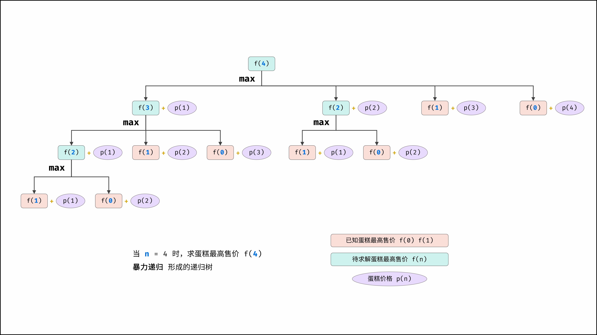

### 方法二：记忆化递归

观察发现，递归树中存在大量重叠子问题，可通过记忆化处理避免重复计算。记忆化递归的算法的时间复杂度为 $O(n^2)$ ，包括：

* $f(2)$ 至 $f(n)$ 共 $n - 1$ 个待计算子问题，使用 $O(n)$ 时间；
* 计算某 $f(i)$ 需遍历 $i - 1$ 种子问题组合，使用 $O(n)$ 时间；

```python
# 输入蛋糕价格列表 price_list ，求重量为 n 蛋糕的最高售价
def max_cake_price(n, price_list, dp):
    if n <= 1: return price_list[n] # 蛋糕重量 <= 1 时直接返回
    f_n = 0
    for i in range(n):  # 从 n 种组合种选择最高售价的组合作为 f(n)
        # 若 f(i) 以前已经计算过，则调取记录的解；否则，递归计算 f(i)
        f_i = dp[i] if dp[i] != 0 else max_cake_price(i, price_list, dp)
        f_n = max(f_n, f_i + price_list[n - i])
    dp[n] = f_n         # 记录 f(n) 至 dp 数组
    return f_n          # 返回 f(n)

def max_cake_price_memorized(n, price_list):
    dp = [0] * (n + 1)
    return max_cake_price(n, price_list, dp)
```

如下图所示，为记忆化递归求解 $f(4)$ 形成的多叉树。观察得知，重叠子问题皆被剪枝。
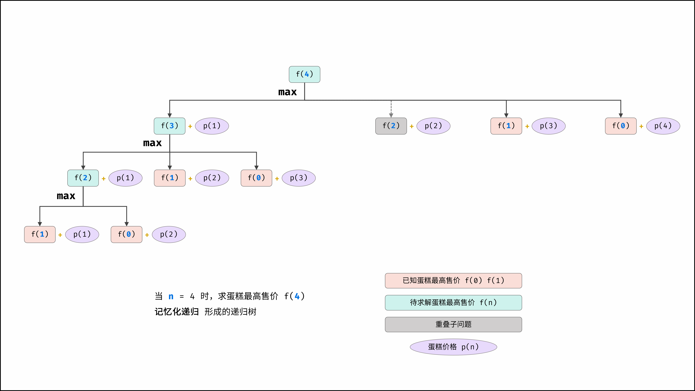

### 方法三：动态规划

```python
# 输入蛋糕价格列表 price_list ，求重量为 n 蛋糕的最高售价
def max_cake_price(n, price_list):
    if n <= 1: return price_list[n] # 蛋糕重量 <= 1 时直接返回
    dp = [0] * (n + 1)              # 初始化 dp 列表
    for j in range(1, n + 1):       # 按顺序计算 f(1), f(2), ..., f(n)
        for i in range(j):          # 从 j 种组合种选择最高售价的组合作为 f(j)
            dp[j] = max(dp[j], dp[i] + price_list[j - i])
    return dp[n]
```

如下图所示，为动态规划求解 $f(4)$ 的迭代流程，其是转移方程 $f(n) = \max_{0 \leq i < n} (f(i) + p(n - i))$的体现。
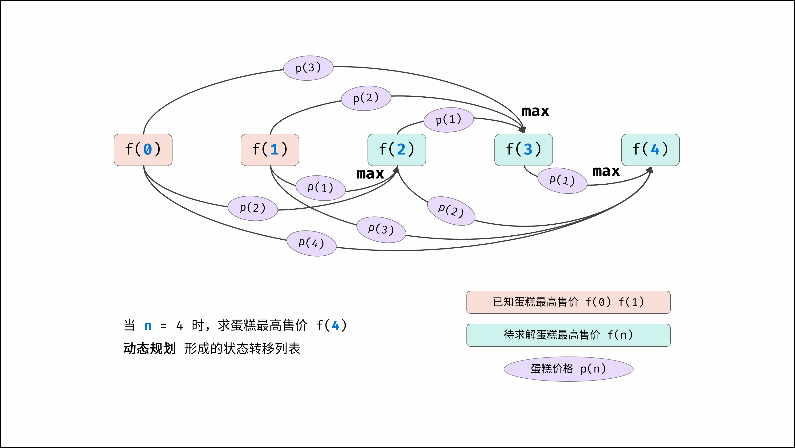

### 示例小结

本题同时包含「重叠子问题」和「最优子结构」，为动态规划的典型问题。动态规划通过填表避免了重复计算问题，并通过状态转移方程、初始状态实现对问题的迭代求解。

普遍来看，求最值 的问题一般都具有「重叠子问题」和「最优子结构」特点，因此此类问题往往适合用动态规划解决。

## 动态规划解题框架

若确定给定问题具有重叠子问题和最优子结构，那么就可以使用动态规划求解。总体上看，求解可分为四步：

1. **状态定义**： 构建问题最优解模型，包括问题**最优解的定义**、有哪些**计算解的自变量**；
2. **初始状态**： 确定**基础子问题的解**（即已知解），原问题和子问题的解都是以基础子问题的解为起始点，在迭代计算中得到的；
3. **转移方程**： 确定原问题的解与子问题的解之间的关系是什么，以及使用何种**选择规则**从子问题最优解组合中选出原问题最优解；
4. **返回值**： 确定应返回的问题的解是什么，即动态规划在**何处停止迭代**；
   完成以上步骤后，便容易写出对应的解题代码。

### 示例：蛋糕最高售价

* 状态定义：一维 $dp$ 列表，设重量为 $i$ 蛋糕的售价为 $p(i)$ ，重量为 $i$ 蛋糕切分后的最高售价为 $dp[i]$ ；
* 初始状态：已知重量为 0 蛋糕的最高售价为 0 ，重量为 1 的蛋糕最高售价为 $p(1)$ ；
* 转移方程： $dp[n]$ 为 $n$ 种切分组合中的最高售价组合，即

$$
dp[n] = \max_{0 \leq i < n} (dp[i] + p(n - i))
$$

* 返回值：需求取的重量为 $n$ 的蛋糕最高售价 $dp[n]$ ；

## 例题练习

### 剑指 Offer 10- II. 青蛙跳台阶问题

#### 题目：

> 一只青蛙一次可以跳上1级台阶，也可以跳上2级台阶。求该青蛙跳上一个 n 级的台阶总共有多少种跳法。
> 答案需要取模 1e9+7（1000000007），如计算初始结果为：1000000008，请返回 1。

示例1：

```
输入：n = 2
输出：2
```

示例2：

```
输入：n = 7
输出：21
```

示例3：

```
输入：n = 0
输出：1
```

#### 解题思路：

初看有点复杂，但是用从顶到底的思路去分析就很简单。
设第 $n$ 阶楼梯的方法数为 $f(n)$, 从题干可得，能选择跳的楼梯数为1和2，所以 $n$ 阶楼梯只能从第 $n-1$ 阶梯跳一级和从第 $n-2$阶梯跳两级得到，所以可得其转移状态函数为：

$$
f(n)=f(n-1)+f(n-2)
$$

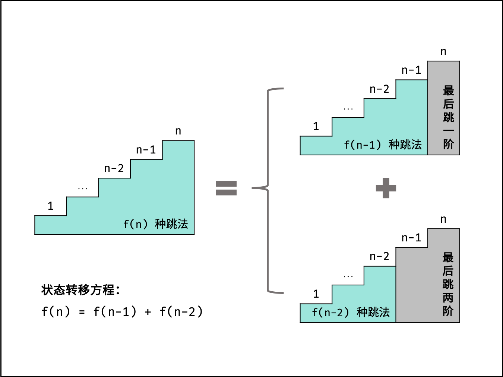

#### 代码：

```python
class Solution:
    def numWays(self, n: int) -> int:
        # 因为从顶到底迭代的话需要递归函数，运算速度没有线性函数这么快，所以这里编写采用从底到顶的编写方法，而且由于不需要长期的记忆，就不需要创建dp列表来存储数据，直接用两个变量交替求和即可
        if n <= 1:return 1
        a,b = 1,1
        for i in range(n-1):
            a,b = (a+b)%1000000007,a  # 与1000000007求余是为了防止越界
        return a
```

### 剑指 Offer 46. 把数字翻译成字符串

#### 题目：

> 给定一个数字，我们按照如下规则把它翻译为字符串：0 翻译成 “a” ，1 翻译成 “b”，……，11 翻译成 “l”，……，25 翻译成 “z”。一个数字可能有多个翻译。请编程实现一个函数，用来计算一个数字有多少种不同的翻译方法。

示例1：

```
输入: 12258
输出: 5
解释: 12258有5种不同的翻译，分别是"bccfi", "bwfi", "bczi", "mcfi"和"mzi"
```

#### 解题思路

根据题意，可按照下图的思路，总结出 “递推公式” （即转移方程）。
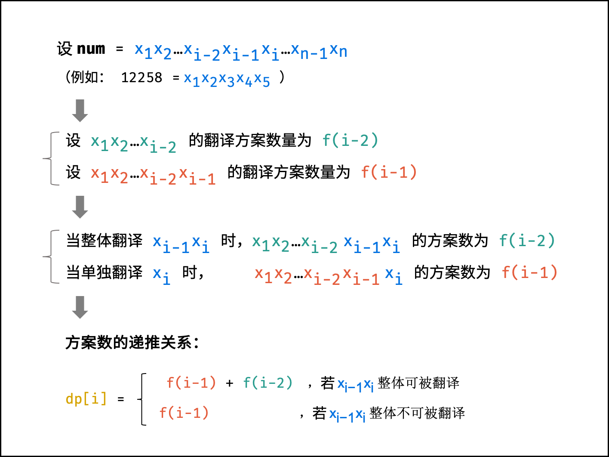
**当思考不出思路时，尽量尝试从顶到底的思路**比如说这题，这题最大的麻烦是不知道什么时候一个数字翻译一个字母，什么时候两个数字翻译一个字母，只需要添加一个判断条件：$x_{n-1}x_{n} \le 25$ 即可，符合这个条件的就可以从 $f(n-2)$ 处继承，若不符合就只能从 $f(n-1)$ 处继承，从本质来看，就是一个**增加了附加条件的青蛙跳台问题**而已。
解题流程如下：

* **状态定义：** 设动态规划列表 $dp$ ，$dp[i]$ 代表以 $x_i$为结尾的数字的翻译方案数量。
* **转移方程：** 若 $x_i$和 $x_{i-1}$组成的两位数字可被整体翻译，则 $dp[i] = dp[i - 1] + dp[i - 2]$，否则 $dp[i] = dp[i - 1]$ 。

$$
dp[i]=\begin{cases}
dp[i−1]+dp[i−2]&,(10x_ {i−1} +x_i)\in[10,25] \\ dp[i−1]&,(10x_ {i−1} +x_i)∈[0,10)∪(25,99]   
\end{cases} $$ 
* **初始状态：** $dp[0]=dp[1]=1$ ，即 “无数字” 和 “第 $1$ 位数字” 的翻译方法数量均为 $1$ ；
* **返回值：** $dp[n]$ ，即此数字的翻译方案数量；
#### 代码：
```python
class Solution:
    def translateNum(self, num: int) -> int:
        a = b = 1
        y = num % 10  # 初始状态下的最后一位数字，这里为了方便编写，采取从右到左运算
        while num > 9:
            num //= 10
            x = num % 10 # 当前的位数
            a, b = (a + b if 10 <= 10 * x + y <= 25 else a), a
            y = x
        return a
```
### 剑指 Offer 47. 礼物的最大价值
这题的经典之处在于其涉及到路线问题，为了表示每一个格子当前的数值，所以需要使用二维列表来装载结果 $dp$
#### 题目：
>在一个 m*n 的棋盘的每一格都放有一个礼物，每个礼物都有一定的价值（价值大于 0）。你可以从棋盘的左上角开始拿格子里的礼物，并每次向右或者向下移动一格、直到到达棋盘的右下角。给定一个棋盘及其上面的礼物的价值，请计算你最多能拿到多少价值的礼物？

示例1：
```
输入: 
[
  [1,3,1],
  [1,5,1],
  [4,2,1]
]
输出: 12
解释: 路径 1→3→5→2→1 可以拿到最多价值的礼物
```
#### 解题思路：
由于路径规定了只能往右和往下，所以，对于二维矩阵 $dp$ 而言，只需要对比上方的累加值和左方的累加值哪个大就继承哪个即可，最后再加上本单元格的数值。状态转移函数如下：（其中 $i$ 代表当前行数， $j$ 代表当前列数）
$$f(i,j) = \max [f(i,j-1),f(i-1),j] + grid(i,j)$$ 
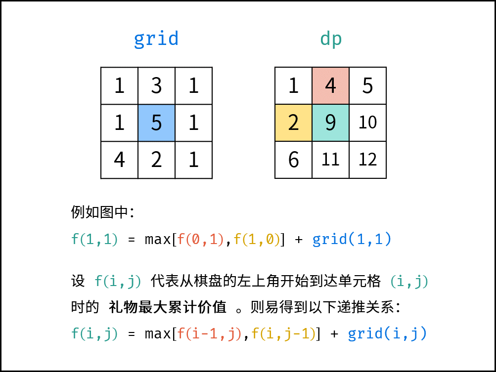
#### 代码如下：
```python
class Solution:
    def maxValue(self, grid: List[List[int]]) -> int:
        for i in range(len(grid)):
            for j in range(len(grid[0])):
                if i == 0 and j == 0: continue
                if i == 0: grid[i][j] += grid[i][j - 1] # 因为边缘地方只有单边所以直接 累加即可
                elif j == 0: grid[i][j] += grid[i - 1][j]
                else: grid[i][j] += max(grid[i][j - 1], grid[i - 1][j])
        return grid[-1][-1]
```
### 剑指 Offer 49. 丑数
十分经典的题目，这道题目核心思路不算很难，但是实现方法很巧妙，而且框架的拓展性很强，可以与很多题目所匹配。
#### 题目：
>我们把只包含质因子 2、3 和 5 的数称作丑数（Ugly Number）。求按从小到大的顺序的第 n 个丑数。

示例：
```
输入: n = 10
输出: 12
解释: 1, 2, 3, 4, 5, 6, 8, 9, 10, 12 是前 10 个丑数。
```
#### 解题思路：
因为丑数是通过因子进行判断的，所以不难想到根据已有的丑数分别乘以2、3、5之后的数依旧是丑数。  
但是问题在于丑数是从小到大排列的，这里涉及到好几个数相乘，如何进行排列是个问题。
这里使用的方法是针对三个数，设置三个指针，每个指针只运行乘以2、乘以3和乘以5这三者中的其中一个操作。  
只有当前数等于对应指针下缀的数乘以对应指针的操作数时，指针才进一，这样的好处是，在进行大小判断时，只需要对三个指针的数进行判断，采用的是哪一个指针，哪一个指针就进一，因为当前指针已经乘以对应的数得到一个 $dp[i]$ 不需要再乘以同样的数再进行判断，所以进一，通过下一个数再进行判断。
递推公式：
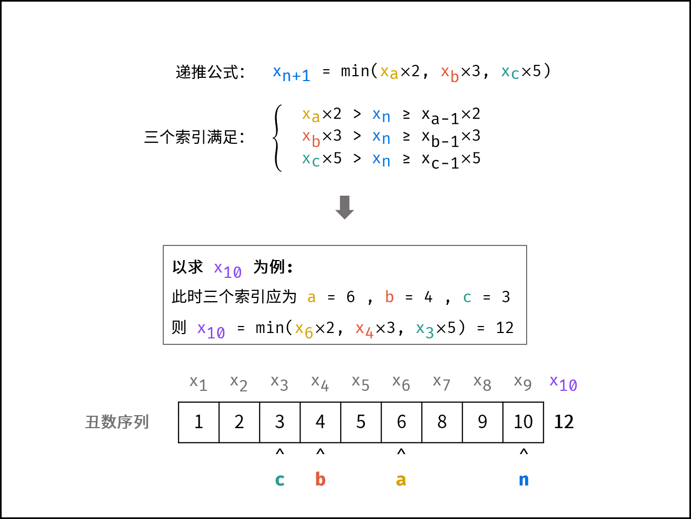
##### 举例：
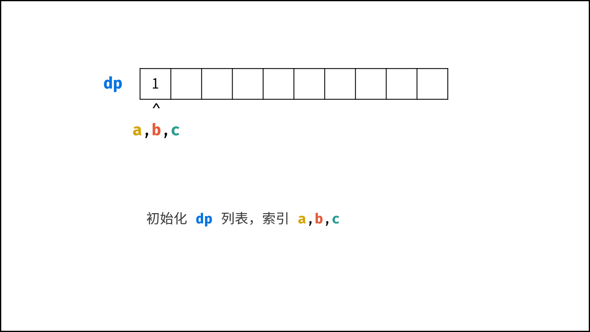
一开始指针全部指向第0个位置1，第1个位置的数理所当然地从（1×2， 1×3， 1×5）中取最小值，这里取2，取2之后，与×2所对应的a指针需要进一，因为2已经取了，后续如果从×2操作的话，不会再从1当中选择，必定从2×2中选择。

后续完整过程：
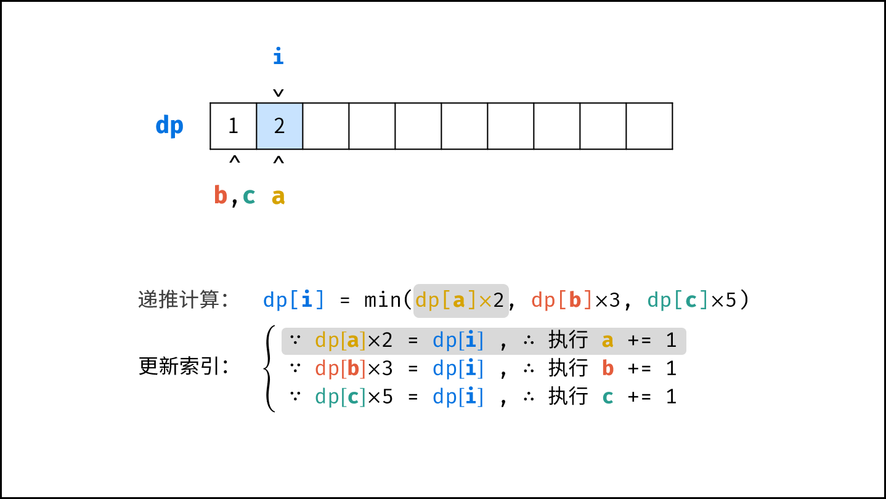
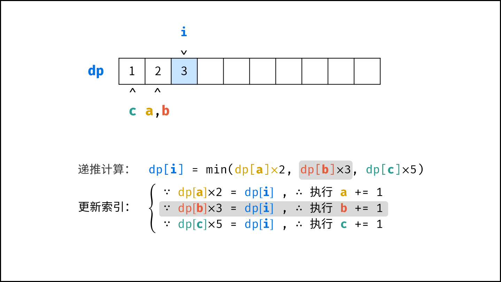
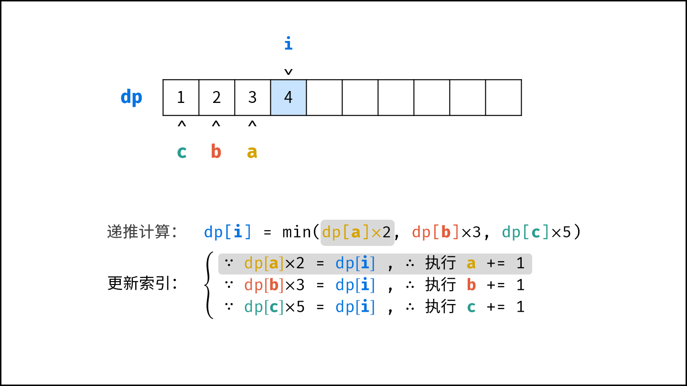
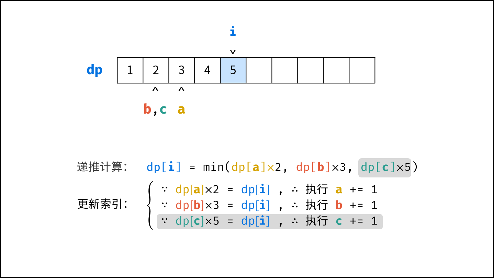
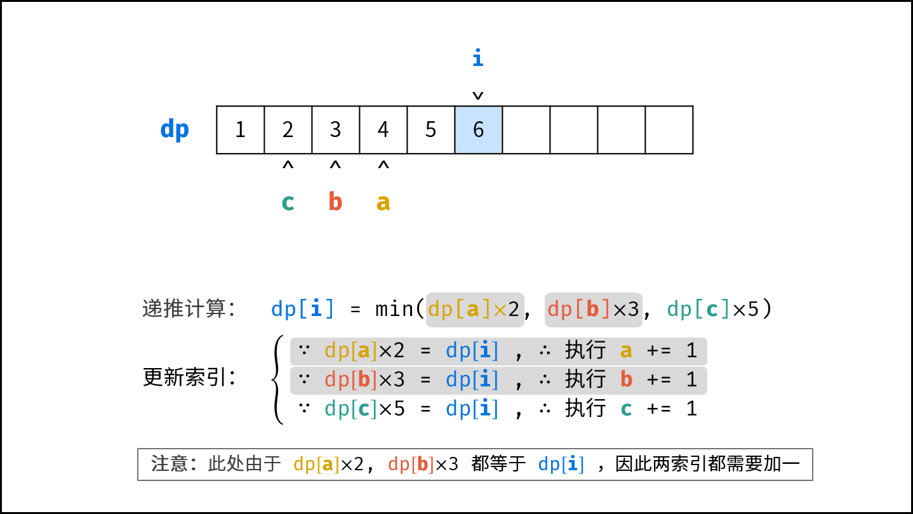
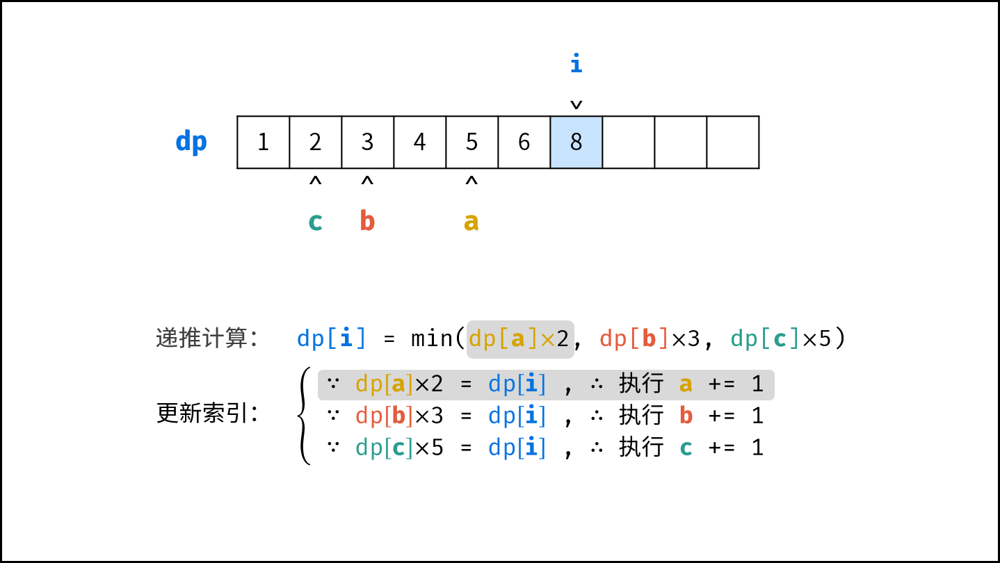
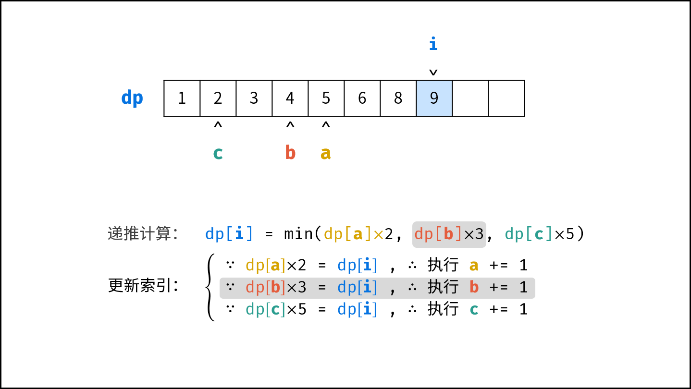
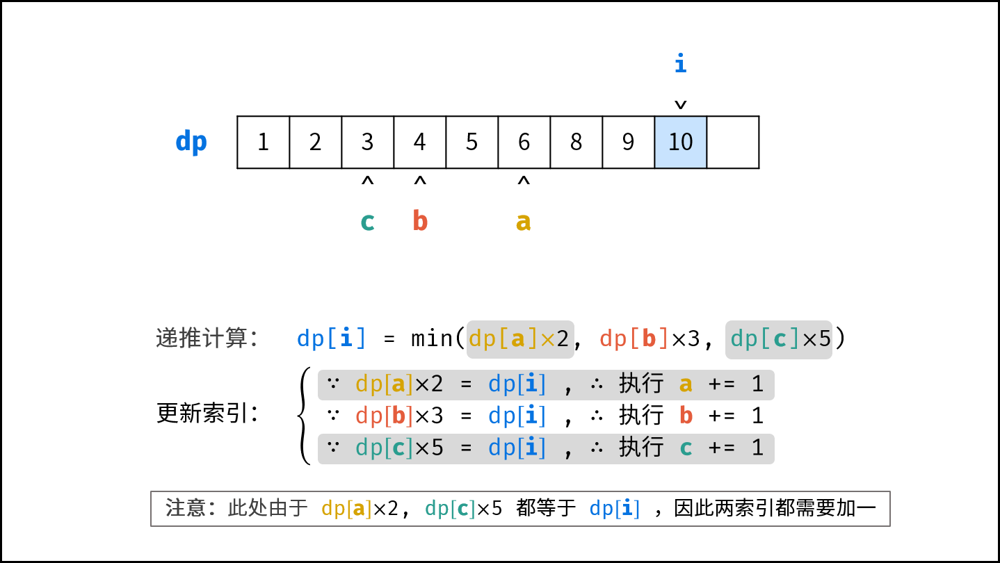
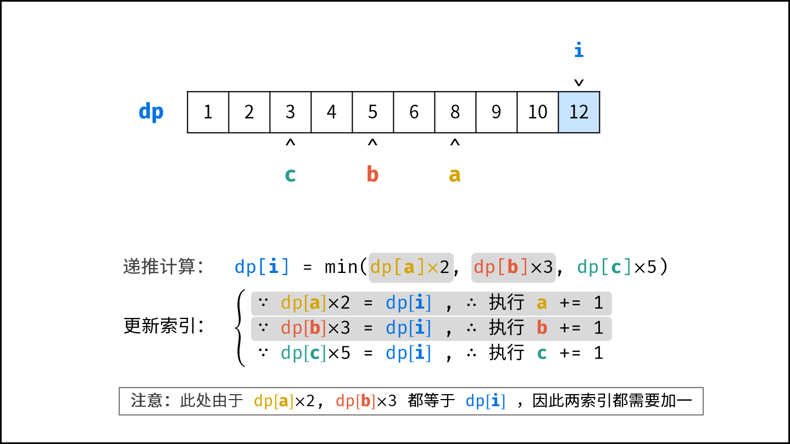
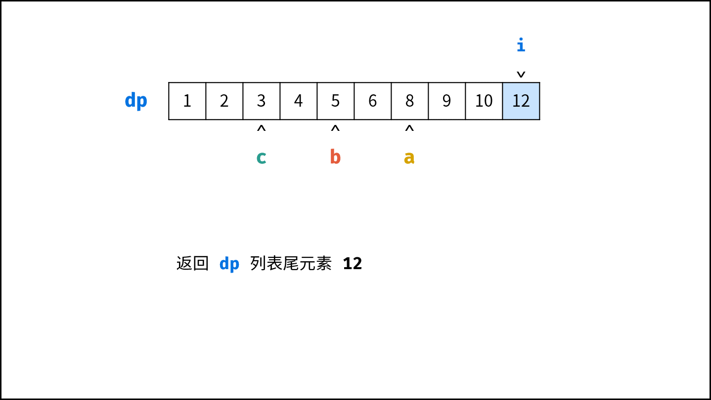
#### 代码：
```python
class Solution:
    def nthUglyNumber(self, n: int) -> int:
        dp, a, b, c = [1] * n, 0, 0, 0
        for i in range(1, n):
            n2, n3, n5 = dp[a] * 2, dp[b] * 3, dp[c] * 5
            dp[i] = min(n2, n3, n5)
            if dp[i] == n2: a += 1
            if dp[i] == n3: b += 1
            if dp[i] == n5: c += 1
        return dp[-1]
```
$$
