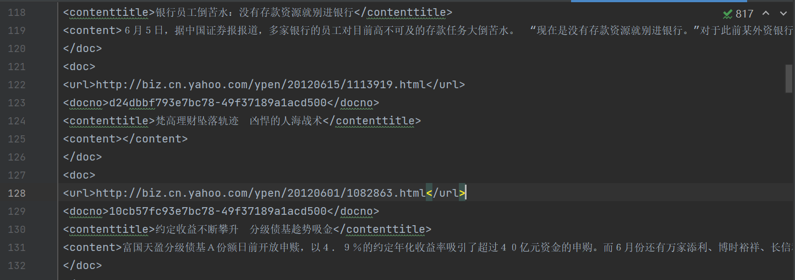
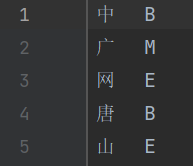

# 1.下载原始数据

文件名：
``data/news_tensite_xml.smarty.date``
数据是从搜狐网站爬虫爬下来的原始数据  
数据如图所示：


# 2.原始数据处理

文件名：
``process_data.py``
首先利用正则运算，读入干净数据（即去除非正文文本部分）。
因为该原始数据并非标注数据，而是无标注内容，数据量太大不可能人为标注，故使用 ``jieba``分词插件对数据进行分词标注，再把标注好的词性文件按照标准格式保存到
``data/train_data.txt``文件。  
具体如图所示：

  
中文分词以单字做分隔，左边是字，右边则是对应的序列标注

# 3.使用CRF脚本生成训练模型

脚本文件名：``scripts/train_crf.sh``
模板文件名：``data/template.txt``
这是一个基于linux语法的脚本，使用模板文件对train_data进行操作生成状态特征函数，并对状态特征函数进行合并相同项，基于神经网络模型和原始数据集做对比，对状态特征函数的权重进行机器学习。其生成的二进制模型保存在 ``model/crf-seg.model``，其可视化记事本模型保存在 ``model/crf-seg.model.txt``

## 3.1条件随机场CRF原理

其原理图如下：

其概率建模如下：

$$
P(y\mid x)=\frac{1}{Z}exp(\sum_{i,j}{\lambda_jt_j(y_{i-1},y_i,x,i)}+\sum_{j,k}{\mu_kt_k(y_i,x,i)})
$$

式中：
$t$是转移特征函数，衡量相邻状态变量的影响；
$s$是状态特征函数，衡量观测序列对状态变量的影响；
$\lambda和\mu$分别是对应特征函数的权重；
$exp$是指数势函数，主要用于定义图模型中的概率分布函数；
$Z$是规范化因子，用于确保整个式子是一个概率；

特征函数本质上是一个bool函数，当达到条件时返回1，否则返回0，所以前面要乘以因子。
转移特征函数举例：

$$
t_j(y_{i-1},y_i,x,i)=I(y_{i-1}=“B”并且y_i=“E”)$$  
$$t_j(y_{i-1},y_i,x,i)=I(y_{i-1}=“B”并且y_i=“M”)
$$

$$
... ...
$$

状态特征函数举例：

$$
s_k(y_i,x,i)=I(x_{i-1}=“昨”并且x_i=“天”并且x_{i+1}=“，”并且y_i=“E”)
$$

$$
s_k(y_i,x,i)=I(x_i=“天”并且y_i=“E”)
$$

$$
... ...
$$

$exp$中左边的部分为转移特征函数的权重项，转移特征函数是用来表征前后文之间的关系的，即$y_i$和$y_{i-1}$之间的关系。因为本CRF模型耦合了bilstm，而且bilstm模型包含记忆权重，本身很适合用来表示前后文之间的关系，所以不同标签之间的转移矩阵则由bilstm模型进行，CRF模型只负责状态特征函数的训练。

## 3.2状态特征函数的生成

而所有的$s_k$都是CRF脚本使用模板文件，在 ``train_data.txt``文件中，对每一个$x_i$都套用所有的模板（18个）依次生成18个状态特征函数，如果条件不满足则不生成这一特征函数。
模板代码如下：

```python
# Unigram 用于生成状态特征函数
# 下面这些都是特征函数的模板，
U00:%x[-3,0]
U01:%x[-2,0]
U02:%x[-1,0]
U03:%x[0,0]
U04:%x[1,0]
U05:%x[2,0]
U06:%x[3,0]
U07:%x[-3,0]/%x[-2,0]
U08:%x[-2,0]/%x[-1,0]
U09:%x[-1,0]/%x[0,0]
U10:%x[0,0]/%x[1,0]
U11:%x[1,0]/%x[2,0]
U12:%x[2,0]/%x[3,0]
U13:%x[-3,0]/%x[-2,0]/%x[-1,0]
U14:%x[-2,0]/%x[-1,0]/%x[0,0]
U15:%x[-1,0]/%x[0,0]/%x[1,0]
U16:%x[0,0]/%x[1,0]/%x[2,0]
U17:%x[1,0]/%x[2,0]/%x[3,0]
```

模板中的%x是指行索引，对相同的位置以行进行索引，[]中第一个数字是指相对与目标行数的相对值，负数表示向上，正数表示向下，第二数字则是以第几列为模板，因为状态特征函数是以观测序列为基准的，所以自然是第0列。比如说，-3表示向上第三个为对比。
为方便理解，以一个实际的观测值通过模板生成状态特征函数：
```
中 B
广 M
网 E
唐 B
山 E
```
对上面的第一个观测值$x_0$使用全部模板依次生成状态特征函数：
因为$x_0$是第一个观测值，所以所有含有负数的模板都不能使用。

$$
s_3(y_0,x,0)=I(x_0=“中”并且y_0=“B”) 参数为0，所以相对行数为0，与本行进行对比
$$

$$
s_4(y_0,x,0)=I(x_1=“广”并且y_0=“B”) 参数为1，所以相对行数为1，与下一行进行对比
$$

$$
s_5(y_0,x,0)=I(x_0=“网”并且y_0=“B”) 参数为2，所以相对行数为2，与下两行进行对比
$$

$$
s_6(y_0,x,0)=I(x_0=“唐”并且y_0=“B”) 参数为3，所以相对行数为3，与下三行进行对比
$$

<br/>

$$
s_{10}(y_0,x,0)=I(x_0=“中”并且x_1=“广”并且y_0=“B”)
$$

$$
参数为0和1，所以相对行数为0和1，与本行和下一行进行对比
$$

$$
s_{11}(y_0,x,0)=I(x_1=“广”并且x_2=“网”并且y_0=“B”)
$$

$$
参数为1和2，所以相对行数为1和2，与下一行和下两行进行对比
$$

$$
s_{12}(y_0,x,0)=I(x_2=“网”并且x_3=“唐”并且y_0=“B”)
$$

$$
参数为2和3，所以相对行数为2和3，与下两行和下三行进行对比
$$

<br/>

$$
s_{16}(y_0,x,0)=I(x_0=“中”并且x_1=“广”并且x_2=“网”并且y_0=“B”)
$$

$$
参数为0和1和2，所以相对行数为0和1和2，与本行和下一行和下两行进行对比
$$

$$
s_{17}(y_0,x,0)=I(x_1=“广”并且x_2=“网”并且x_3=“唐”并且y_0=“B”)
$$

$$
参数为1和2和3，所以相对行数为1和2和3，与下一行和下两行和下三行进行对比
$$

将所有$s_k$生成之后，将完全相同的$s_k$进行合并，并且通过神经网络进行训练，最终得到各状态特征函数的权重
脚本代码如下：

```python
cd ..  
crf_learn -f 2 -c 2 -t data/template.txt data/train_data.txt model/crf-seg.model
```

``cd..``是为了跳转回上一级目录（即项目根目录），因为脚本中的相对目录都是基于项目根目录的，``-f 2``的意思则是把出现次数过小（次数小于2）的特征函数筛掉，因为出现次数过小的特征函数不具有一般性，会影响到模型的适用性，``-c``则是负责调节模型是过拟合还是欠拟合，这里采用参数2，比较折中。

# 4.CRF模型的解码

文件名：``crfpp_model.py``

## 4.1crf-seg.model.txt内容解释

前三部分内容如下，依次是CRF模型概述、标签种类和模板。

```
version: 100
cost-factor: 1
maxid: 512528
xsize: 1

B
E
M
S

U00:%x[-3,0]
U01:%x[-2,0]
U02:%x[-1,0]
U03:%x[0,0]
U04:%x[1,0]
U05:%x[2,0]
U06:%x[3,0]
U07:%x[-3,0]/%x[-2,0]
U08:%x[-2,0]/%x[-1,0]
U09:%x[-1,0]/%x[0,0]
U10:%x[0,0]/%x[1,0]
U11:%x[1,0]/%x[2,0]
U12:%x[2,0]/%x[3,0]
U13:%x[-3,0]/%x[-2,0]/%x[-1,0]
U14:%x[-2,0]/%x[-1,0]/%x[0,0]
U15:%x[-1,0]/%x[0,0]/%x[1,0]
U16:%x[0,0]/%x[1,0]/%x[2,0]
U17:%x[1,0]/%x[2,0]/%x[3,0]
B
```

其中最后一行为转移特征的模板，CRF插件有内置转移特征模板，依据标签的数量自动生成，为一个n*n的矩阵（n为标签的个数）
然后是生成的特征函数，部分展示：

```
0 B
16 U00:"
20 U00:%
24 U00:(
28 U00:)
32 U00:*
36 U00:-
40 U00:.
44 U00:/
48 U00:0
52 U00:1
56 U00:2
60 U00:3
64 U00:4
68 U00:5
```

因为转移特征函数是一个n*n的矩阵，这里的n为4，共有16位参数，所以0到15都是转移特征的参数，状态特征函数从第16位开始。
U00:"表示使用所有使用0模板生成字符"的状态特征函数，而状态特征函数除了与观测序列x相关，也与当前状态变量的标签$y_i$有关，如上文提到的$s_3(y_0,x,0)=I(x_0=“中”并且y_0=“B”)$,所以这里的U00:"只表示该状态特征函数的观测序列$x$，没有提到状态变量$y$。但我们观察到不同状态特征函数的序号相隔4位，与标签数相同，这意味着这种表示方法只是把对应的状态变量标签给隐藏了而已。
所以正确的含义为：

```
16 根据模板0，xi=“"”并且y=“B”
17 根据模板0，xi=“"”并且y=“E”
18 根据模板0，xi=“"”并且y=“M”
19 根据模板0，xi=“"”并且y=“S”
20 同理
```

再下面则是与按顺序与上面特征函数所一一对应的权重，上面一共生成了512528个特征函数，下面则是有相同数量的权重与其一一对应。

```
-0.1799429379903773
0.0692206497209612
-0.1994258619168375
0.1055943639932452
0.0246108482025617
-0.0653627325858280
0.2607564255235563
-0.0610116640805678
-0.1343820288571939
-0.0214821151628006
-0.0236822503128246
-0.0055415801179137
0.0507059455935257
0.6123304774342618
```

## 4.2以一个测试样例为例子阐述解码过程

主函数调用测试集代码：

```python
if __name__ == '__main__':
    model = CRFPPModel('model/crf-seg.model.txt')   # 将训练好的模型传进去
    print(model.get_tags())

    # 计算文本中每个位置的发射score（累加状态特征函数的权重）
    content = '今天天气不错哈'
    for i in range(len(content)):
        print('\ncur index:', i)
        features = model.gen_feature(content, len(content), i)  # 针对位置i，根据模板生成其状态特征函数
        print('features:\n', '  '.join(features))
        score = model.compute_score(features)
        print('score: ', score)
```

生成结果如下：

```
cur index: 0
features:
 U00:_B-3  U01:_B-2  U02:_B-1  U03:今  U04:天  U05:天  U06:气  U07:_B-3/_B-2  U08:_B-2/_B-1  U09:_B-1/今  U10:今/天  U12:天/气  U13:_B-3/_B-2/_B-1  U14:_B-2/_B-1/今  U15:_B-1/今/天
score:  {'B': 5.861935526937477, 'E': -4.2093528602640085, 'M': -4.585138426743594, 'S': 2.932555760038332}

cur index: 1
features:
 U00:_B-2  U01:_B-1  U02:今  U03:天  U04:天  U05:气  U06:不  U07:_B-2/_B-1  U08:_B-1/今  U09:今/天  U11:天/气  U13:_B-2/_B-1/今  U14:_B-1/今/天
score:  {'B': -0.047821463483639415, 'E': 0.6331349364136641, 'M': 0.9172902347079527, 'S': -1.5026037076757022}

cur index: 2
features:
 U00:_B-1  U01:今  U02:天  U03:天  U04:气  U05:不  U06:错  U07:_B-1/今  U08:今/天  U10:天/气  U12:不/错  U13:_B-1/今/天
score:  {'B': -0.30784617128141756, 'E': -0.41857212857975884, 'M': 0.8529131624840136, 'S': -0.12649486264301746}

cur index: 3
features:
 U00:今  U01:天  U02:天  U03:气  U04:不  U05:错  U06:哈  U07:今/天  U09:天/气  U11:不/错
score:  {'B': -0.9276429112159823, 'E': 1.3719162483374598, 'M': -0.8912475894325711, 'S': 0.4469742523072309}

cur index: 4
features:
 U00:天  U01:天  U02:气  U03:不  U04:错  U05:哈  U06:_B+1  U08:天/气  U10:不/错
score:  {'B': -0.13608079039639676, 'E': -1.2594903179327366, 'M': 0.03886771810763848, 'S': 1.3567033902041765}

cur index: 5
features:
 U00:天  U01:气  U02:不  U03:错  U04:哈  U05:_B+1  U06:_B+2  U07:天/气  U09:不/错  U12:_B+1/_B+2
score:  {'B': 0.10063520625808516, 'E': 0.0852357312524564, 'M': 0.1647371175472404, 'S': -0.3506080550900221}

cur index: 6
features:
 U00:气  U01:不  U02:错  U03:哈  U04:_B+1  U05:_B+2  U06:_B+3  U11:_B+1/_B+2  U12:_B+2/_B+3  U17:_B+1/_B+2/_B+3
score:  {'B': -3.603520017197252, 'E': 4.743773646198628, 'M': -4.3472367288389515, 'S': 3.206983099832007}
```

这里表示不考虑lstm模型下上下文之间的联系，仅考虑CRF状态特征函数求和下，测试集$x_i$下其对应$y_i$各标签的得分。
以测试集"今天天气不错哈"作为例子讲述
其$x_0$为“天”，以天套用18个模板可生成以下状态特征函数：

```
U00:_B-3  U01:_B-2  U02:_B-1  U03:今  U04:天  U05:天  U06:气  U07:_B-3/_B-2  U08:_B-2/_B-1  U09:_B-1/今  U10:今/天  U12:天/气  U13:_B-3/_B-2/_B-1  U14:_B-2/_B-1/今  U15:_B-1/今/天
```

然后在模型库中，找到与这些特征函数所对应的权重，并将各标签的权重分别求和，即可得出各个标签的得分。
同时，你会发现有些模板所对应的特征函数不存在，比如序号为4时，只有模板0，1，2，3，4，5，6，8，10，这通常是两个原因，一个原因是该模板生成的特征函数在模型库中并不存在，这是因为模型库是根据训练集生成的，训练集不可能将所有的情况都全包含。另一个原因则是在我生成模型时，为了模型的普适性，防止出现过拟合，设置出现次数小于2的特征函数不生成。

### 状态特征的含义

表示在不考虑上下文的情况，依据训练集的经验，只看单个字节，其各标签的得分。
如序号为0的测试集“今”，在不考虑上下文的情况下，其为“B”（开始）的概率最高，其次是作为“S”（单字），作为“E”（结束）的概率就很低了，其得分甚至为负数，最近的则是作为“M”（中间）。

# 5.转移特征函数的生成（BiLstm与CRF的耦合）

文件名：``bilstm_crf..py``
