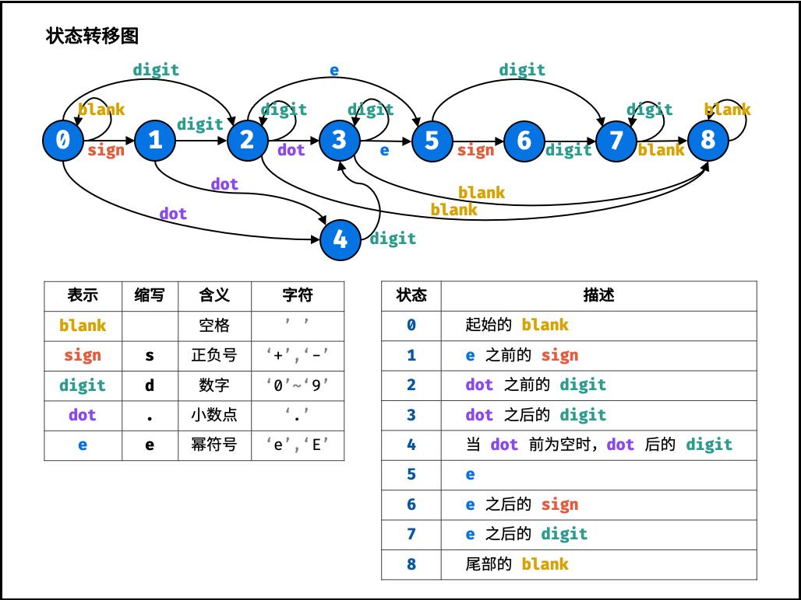
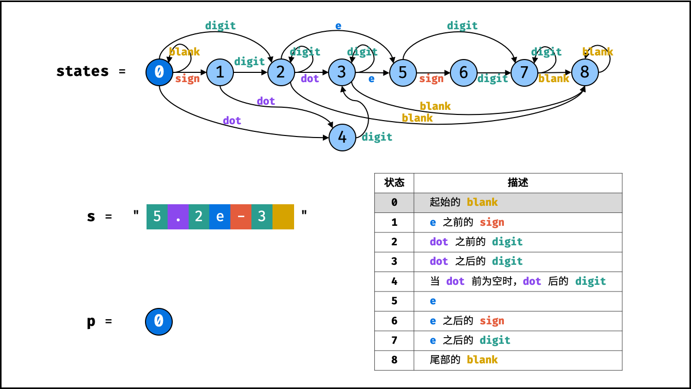
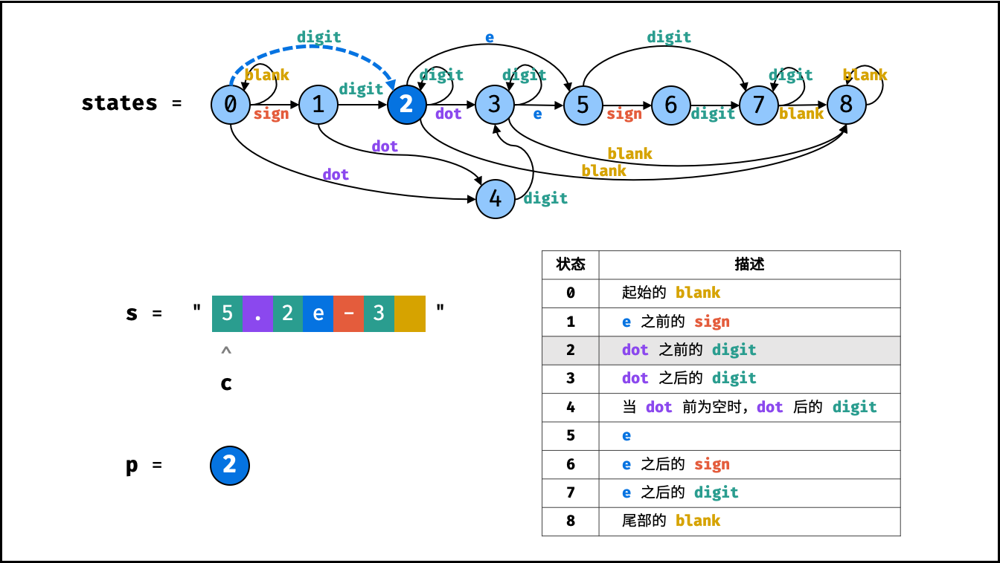
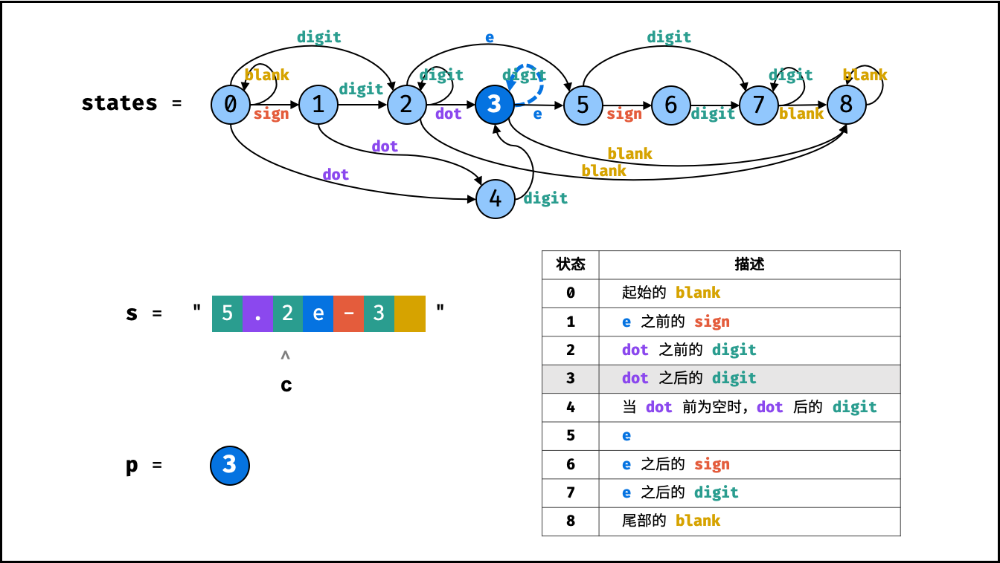
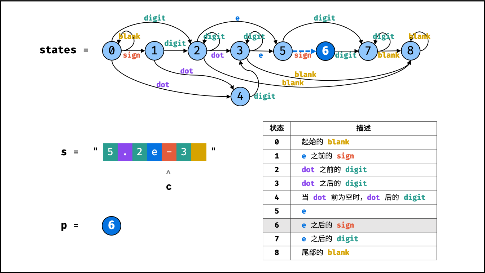
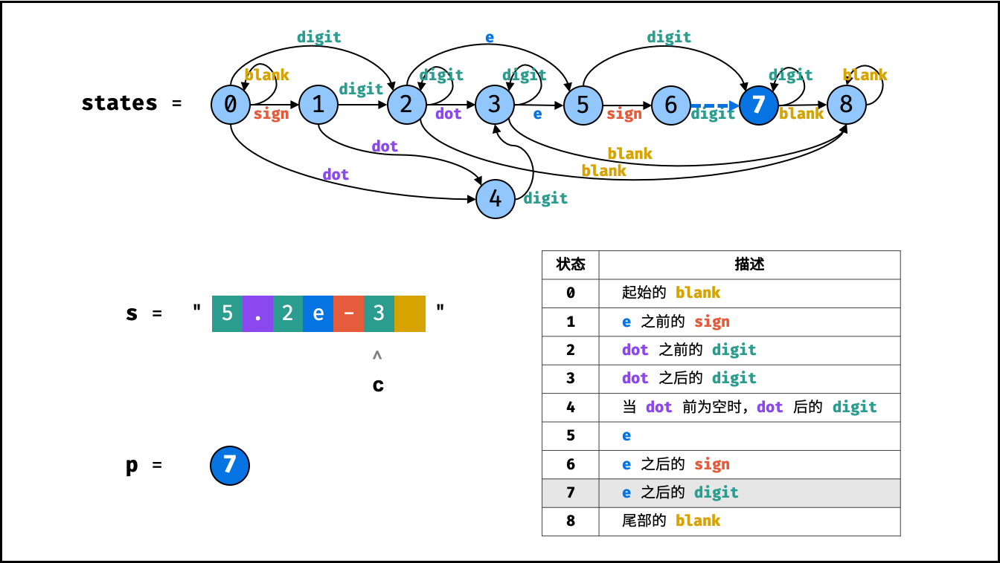
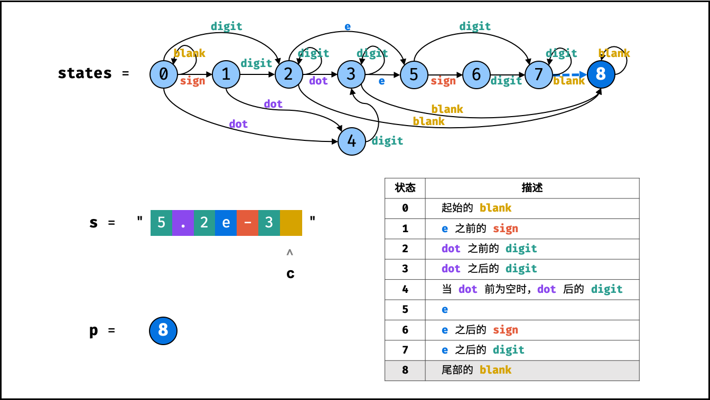
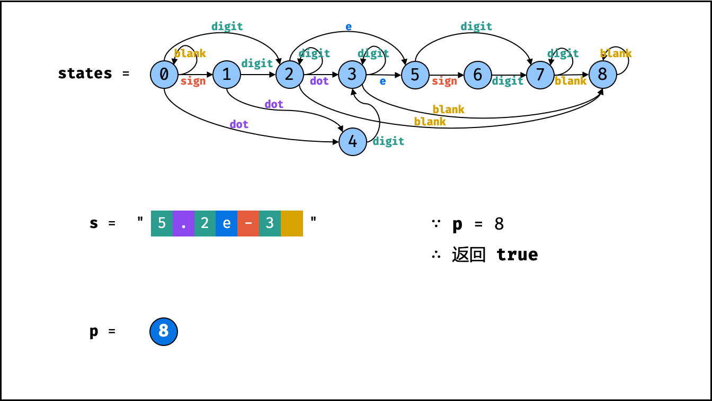

# 有限状态自动机
原理就是先划分合法的状态图，将所有有可能的情况和对应的转移状态记录好，然后根据这个状态图，分别维护三个变量，分别是state和两个中间变量p,t。  
state表示每个状态下可能的转移变量，数据类型为一个列表，列表中的元素为字典，每一个状态都单独为一个字典，字典中的key为转移标签t,即为当前类型，value则为当前标签下转移成的下一个状态p。  
下面以一道例题来说明情况。
## 剑指 Offer 20. 表示数值的字符串
### 题目：
请实现一个函数用来判断字符串是否表示数值（包括整数和小数）。  
数值（按顺序）可以分成以下几个部分：  
    &emsp;&emsp;1.若干空格  
    &emsp;&emsp;2.一个 小数 或者 整数  
    &emsp;&emsp;3.（可选）一个 'e' 或 'E' ，后面跟着一个 整数  
    &emsp;&emsp;4.若干空格  
小数（按顺序）可以分成以下几个部分：  
&emsp;&emsp;1.（可选）一个符号字符（'+' 或 '-'）  
&emsp;&emsp;2.下述格式之一：  
&emsp;&emsp;&emsp;&emsp;1.至少一位数字，后面跟着一个点 '.'  
&emsp;&emsp;&emsp;&emsp;2.至少一位数字，后面跟着一个点 '.' ，后面再跟着至少一位数字  
&emsp;&emsp;&emsp;&emsp;3.一个点 '.' ，后面跟着至少一位数字  
整数（按顺序）可以分成以下几个部分：  
&emsp;&emsp;1.（可选）一个符号字符（'+' 或 '-'）  
&emsp;&emsp;2.至少一位数字  
部分数值列举如下：  
&emsp;&emsp;·```["+100", "5e2", "-123", "3.1416", "-1E-16", "0123"]```  
部分非数值列举如下：  
&emsp;&emsp;·```["12e", "1a3.14", "1.2.3", "+-5", "12e+5.4"]```  
  
示例1：
```
输入：s = "0"
输出：true
```
示例2：
```
输入：s = "e"
输出：false
```
示例3：
```
输入：s = "."
输出：false
```
示例4：
```
输入：s = "    .1  "
输出：true
```
### 题解：
题解链接：https://leetcode.cn/leetbook/read/illustration-of-algorithm/5dkal2/  
依照题意绘制状态转移图：
  
其中，为了避免歧义，每一个状态下，都不能有重复的转移标志，每一个转移标志都只能有一种，要是有连续的相同转移标志，就像下图那样，插入自转移标志（即状态不变，比如图中0通过blank转移标志后又转移回自己）
#### 算法流程：
1.初始化：  
&emsp;&emsp;1.状态转移表 states ： 设 states[i] ，其中 i 为所处状态， states[i] 使用哈希表存储可转移至的状态。键值对 (key, value) 含义：输入字符 key ，则从状态 i 转移至状态 value。  
&emsp;&emsp;2.当前状态 p ： 起始状态初始化为 p = 0 。
2.状态转移循环： 遍历字符串 s 的每个字符 c 。  
&emsp;&emsp;1.记录字符类型 t ： 分为四种情况。  
&emsp;&emsp;&emsp;&emsp;当 c 为正负号时，执行 t = 's' ;  
&emsp;&emsp;&emsp;&emsp;当 c 为数字时，执行 t = 'd' ;  
&emsp;&emsp;&emsp;&emsp;当 c 为 e 或 E 时，执行 t = 'e' ;  
&emsp;&emsp;&emsp;&emsp;当 c 为 . 或 空格 时，执行 t = c （即用字符本身表示字符类型）;  
&emsp;&emsp;&emsp;&emsp;否则，执行 t = '?' ，代表为不属于判断范围的非法字符，后续直接返回 false。  
&emsp;&emsp;2.终止条件： 若字符类型 t 不在哈希表 states[p] 中，说明无法转移至下一状态，因此直接返回 false。  
&emsp;&emsp;3.状态转移： 状态 p 转移至 states[p][t]。  
3.返回值： 跳出循环后，若状态 p ∈2,3,7,8 ，说明结尾合法，返回 true，否则返回 false 。
#### 算法流程图：
---
presentation:
  theme: serif.css
  mouseWheel: true
---
<!-- slide -->

<!-- slide -->

<!-- slide -->

<!-- slide -->

<!-- slide -->

<!-- slide -->

<!-- slide -->

<!-- slide -->

<!-- slide -->

---
### 代码：
``` python
class Solution:
    def isNumber(self, s: str) -> bool:
        state = [
            {' ':0,'s':1,'d':2,'.':4}, # 起始的blank
            {'d':2,'.':4},# e之前的sign
            {'d':2,'.':3,'e':5,' ':8}, # dot之前的digit
            {'d':3,'e':5,' ':8}, # dot之后的digit
            {'d':3},# 当dot前为空时，dot后的digit
            {'s':6,'d':7}, # e
            {'d':7}, # e之后的sigh
            {'d':7,' ':8}, # e之后的digit
            {' ':8} # 尾部的blank
        ]
        p = 0   # 默认从第0个位置开始
        for c in s:
            if '0' <= c <='9':t = 'd' # 根据当前c判断其类型，再将当前指标类型传入到中间变量t中
            elif c in '+-':t = 's'
            elif c in 'eE':t = 'e'
            elif c in '. ':t = c
            else: t = '?' # 防止出现t没有数据报错的情况，当c不符合上述情况时，给t赋予随便的值
            if t not in state[p] : return False # 就是说t这时的值不符合有限状态机里的合法情况，所以直接报错
            p = state[p][t] # 当状态合法时，实施状态转移，p的新状态是从上一个状态索引的字典中，根据t作为关键词进行索引的。
        # 当整个循环都遍历了没有报错返回，就说明这个字符串是没有问题的，直接返回正确
        return p in (2,3,7,8)
```
